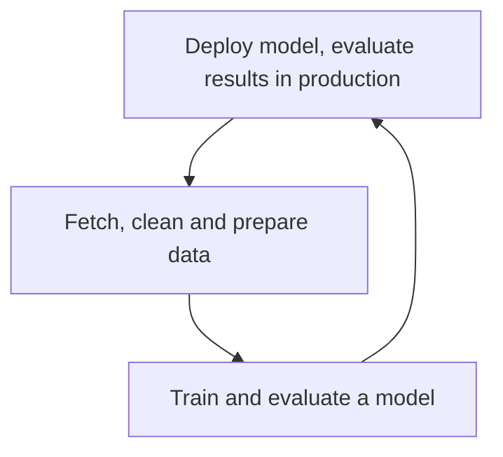
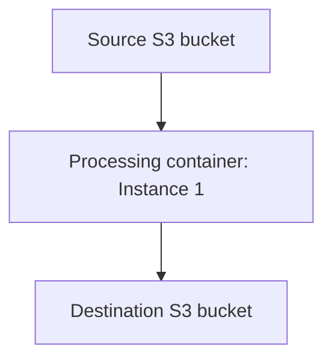

# MLS-C01 notes
Source: [Udemy Course](https://www.udemy.com/course/aws-certified-machine-learning-specialty-mls): 

## Course specific notes
1. Jump to section 4 only when fully familiar with AWS concepts like IAM, Storage, Database etc.

# Expectaion from candidate 
1. Two years of hands-on experience developing, architecting, and running ML or deep learning workloads
2. Basic ML Knowledge (algorithmsd)
3. Experience performing basic hyperparameter optimisation
4. Experience with ML and deep learning frameworks
5. Ability to follow model-traning, deployment, and operational best practices.

## Target Audience
1. AI/ML Engineer or Data Science role

## Goal
1. Select and justify the appropriate ML approach for a given business problem.
2. Identify appropriate AWS services to implement ML solutions.
3. Design and implement scalable, cost-optimised, reliable, and secure ML solutoins.

# Importnat topics for exam:
1. SageMaker
   
## Exam notes
1. Very theorotical exam

## Notes
1. AWS IAM -> Users, Groups, Roles, Policies

###  Emsamble methonds
Common example: Random forest
- Decisio trees are prne to overfitting
- So, makes lot of decision trees and let them all vote on the result
- This is a randomw forest
#### How do they differ?
##### Bagging: Generate N new training sets by random samplign with replacement
Bagging works in parallel manner.
Each resampled model can be trained in parallel
e.g. one model can classify and say it is Class 1, another model can say it is Class 1 too, the third model can say it is Class 3. Essentially the decision is taken after taking into consideration all the inputs.

##### Boosting: With boosting we assign weight to each observation in our dataset.
Boosting Works in a serial manner.
We start off assuming all the data points have equal weight, and as we run the model we keep refining those weights. This results in a better model.

##### How to choose Bagiing vs Boosting?
- XGBoost is the in trend, log of kaggle challenges are won by XGboost. If you care by accuracy then this should solve.
- Boosting generally yields better accuracy
- But bagging avoids overfitting
- Bagging is easier to parallelize, hence can work in parallel.
- So, depend on your goal

## SageMaker
SageMaker is build to handle the entire machine learning workflow. 
Important for exam.
### Capabilities of SageMaker
1. Deploy model, evaluate results in production.
2. Fetch, clean and prepare data
3. Train and evaluate a model
This is a cyclic

1. Notebook instances of EC2 are spun up from the console
* Have direct access to S3
* Scikit_learn, Spark, Tensorflow
* Wide variery of built-in models
* Ability to spin up training instances
* Ability to deploy trainied models for making prediction at scale
* Can also instructe SageMaker form notebook to do the hyper-parameter tuning job on my model

SageMaker expect the data to comes from the S3 bucket.
The format depends on the code you have written for the model.
For the built-in model usually it is RecordIO/ Protobuf format. The built-in models can also take CSVs but RecordIO/Protobuf will be lot more efficient if we can do that.

Preprocessing can also be done in SageMaker notebook.

Input source for the data could be Athena, EMR, Redshift and Amazon keyspaces databases.#

#### Can also integrate Spark with SageMaker.
If you want to pre-process massive data using Spark, you can use SageMaker within Spark to do so.

Standard tools that are available in Jupyter Notebook e.g. Scikit_learn, NunPy are also available here to slice and dice the data before feeding the data to the training job(model).

