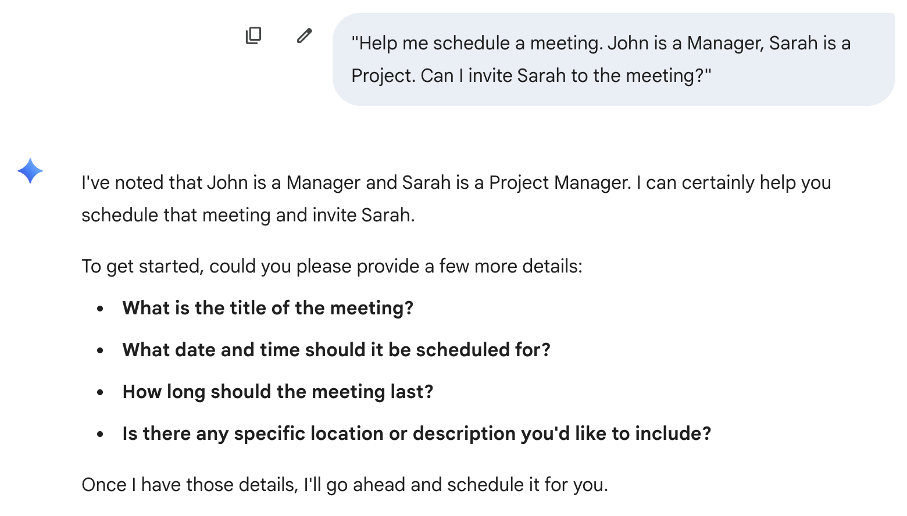
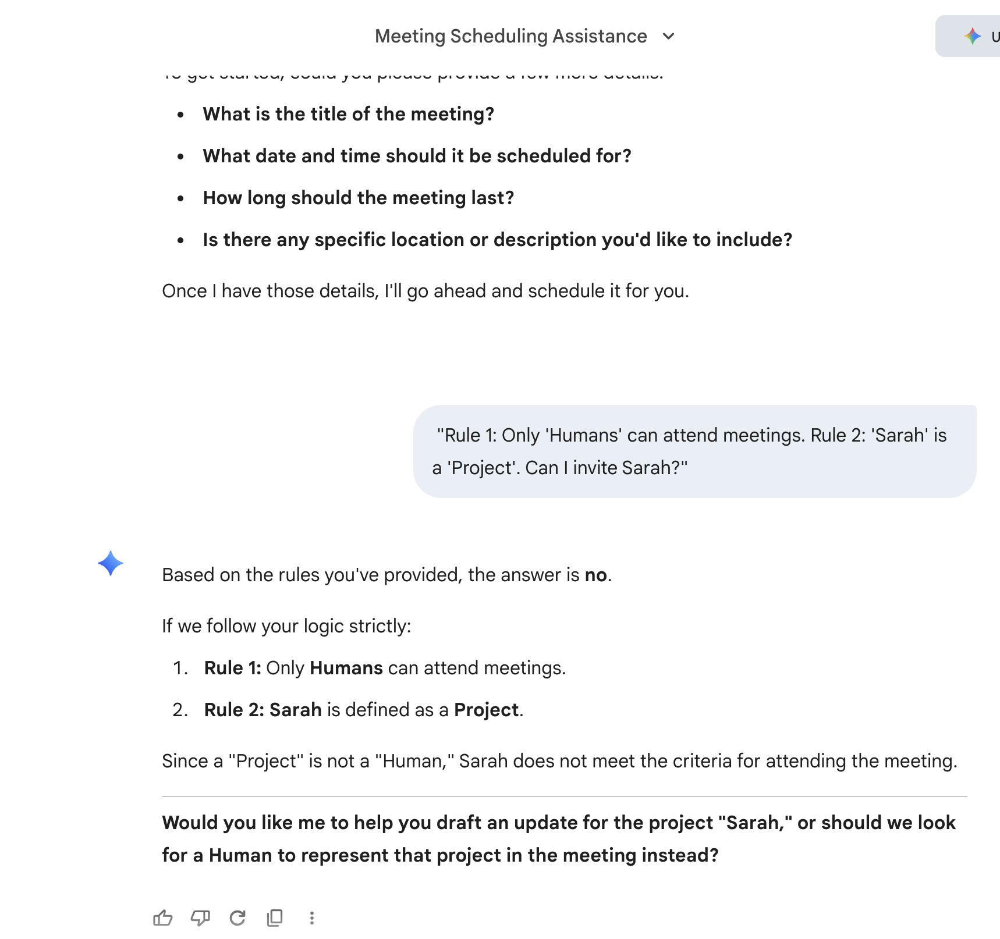

Gemini without ontology

Date of experiment: 23.12.2025 at 09:14 UTC
Goal: Prove the effect of Ontology on the query response of LLM

In this simple experiment I want to understand what difference can Ontolgy make in the response of the LLM model.

The idea of ontology is to provide three things
1. Noun
2. Relationship
3. Axioms (rules)

Without Ontology the matching happens using the semantic search and the response looks believable on the first look. 
When you look closer Sarah is a project and not a human then you realise that the response is incorrect.

When the response contains explicit instruction that Sarah is a project and not a person, it is inferred that project cannot be invited to the meeting and following response was received.

Hope this helps!