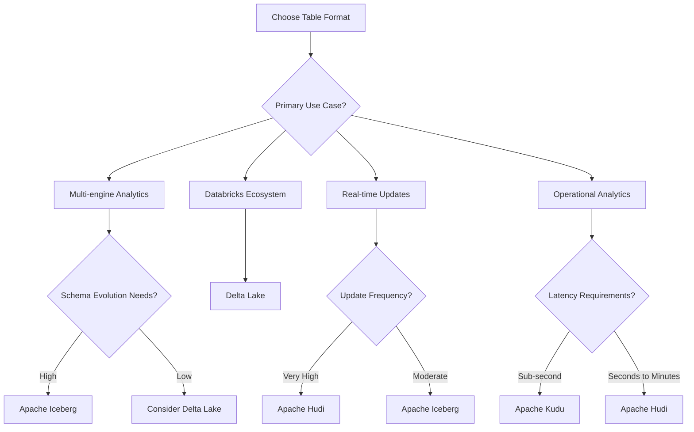

# Apache Iceberg Table Format: A Comprehensive Guide

## What is Apache Iceberg Table Format?

Apache Iceberg is an open-source **table format** designed for large-scale analytics on data lakes. It's not a storage engine or execution engine, but rather a **specification** that defines how table metadata is organized and managed. Think of it as a "contract" that defines how data files, schema, and partitioning information should be structured and tracked.

### Key Characteristics:
- **Open Table Format**: Platform-agnostic specification
- **ACID Transactions**: Provides atomicity, consistency, isolation, and durability
- **Schema Evolution**: Supports safe schema changes over time
- **Time Travel**: Query data as it existed at any point in time
- **Partition Evolution**: Change partitioning schemes without rewriting data

## Why is a Table Format Necessary?

Traditional data lake approaches using raw files (Parquet, ORC, etc.) in object storage face several challenges that table formats solve:

### Problems with Raw File Approaches:

#### 1. **Metadata Management Complexity**
```
Data Lake without Table Format:
├── sales_data/
│   ├── year=2023/month=01/day=01/file1.parquet
│   ├── year=2023/month=01/day=01/file2.parquet
│   ├── year=2023/month=01/day=02/file1.parquet
│   └── ... (thousands of files)
└── No centralized metadata about schema, partitions, or relationships
```

#### 2. **Lack of ACID Transactions**
- Multiple writers can corrupt data
- No consistent reads during writes
- No atomic operations across multiple files

#### 3. **Schema Evolution Challenges**
- Adding columns requires rewriting all files
- No safe way to change data types
- Schema changes break existing queries

#### 4. **Performance Issues**
- Query engines must scan all files to understand structure
- No statistics for query optimization
- Difficult to implement efficient deletes and updates

### How Table Formats Solve These Problems:

#### 1. **Centralized Metadata**
```
Table Format Approach:
├── table_metadata/
│   ├── metadata.json (schema, partitioning, snapshots)
│   ├── manifest_list.avro (lists of manifest files)
│   └── manifest_files.avro (file-level metadata)
└── data_files/ (actual data files)
```

#### 2. **ACID Guarantees**
- Atomic commits ensure consistency
- Isolation prevents read/write conflicts
- Durability guarantees data persistence

#### 3. **Schema Evolution Support**
- Add, drop, rename columns safely
- Change data types with compatibility rules
- Maintain backward compatibility

#### 4. **Performance Optimizations**
- File-level statistics for query planning
- Efficient delete/update operations
- Partition pruning and projection pushdown

## Who Created Apache Iceberg Format?

### Origins and History

**Created by**: Netflix in 2017
**Open Sourced**: 2018
**Apache Incubation**: January 2020
**Apache Top-Level Project**: May 2020

### Key Contributors:
- **Ryan Blue** (Netflix) - Principal architect and creator
- **Antoine Amend** (Netflix) - Core contributor
- **Netflix's Data Platform Team** - Initial development
- **Apache Software Foundation** - Current maintainer

### Timeline:
- **2017**: Development started at Netflix to solve data lake challenges
- **2018**: Open sourced on GitHub
- **2020**: Donated to Apache Software Foundation
- **2020-Present**: Active development with contributions from major tech companies

### Why Netflix Created Iceberg:
Netflix faced challenges with their petabyte-scale data lake:
- Hundreds of thousands of Hive partitions
- Complex schema evolution requirements
- Need for reliable ACID transactions
- Performance issues with metadata operations

## Features of Apache Iceberg with Examples

### 1. **ACID Transactions**

```python
# Example: Atomic write operation
from pyspark.sql import SparkSession

spark = SparkSession.builder \
    .appName("IcebergExample") \
    .config("spark.sql.extensions", "org.apache.iceberg.spark.extensions.IcebergSparkSessionExtensions") \
    .config("spark.sql.catalog.spark_catalog", "org.apache.iceberg.spark.SparkSessionCatalog") \
    .config("spark.sql.catalog.spark_catalog.type", "hive") \
    .getOrCreate()

# Write data atomically - either all succeeds or all fails
df = spark.createDataFrame([
    (1, "Alice", "2023-01-01"),
    (2, "Bob", "2023-01-02"),
    (3, "Charlie", "2023-01-03")
], ["id", "name", "date"])

df.writeTo("my_catalog.my_database.users") \
  .using("iceberg") \
  .createOrReplace()
```

### 2. **Schema Evolution**

```sql
-- Add a new column safely
ALTER TABLE my_catalog.my_database.users 
ADD COLUMN email string;

-- Rename a column
ALTER TABLE my_catalog.my_database.users 
RENAME COLUMN name TO full_name;

-- Change column type (with compatibility)
ALTER TABLE my_catalog.my_database.users 
ALTER COLUMN id TYPE bigint;
```

### 3. **Time Travel**

```sql
-- Query data as it existed 1 hour ago
SELECT * FROM my_catalog.my_database.users 
TIMESTAMP AS OF '2023-12-01 10:00:00';

-- Query data at a specific snapshot
SELECT * FROM my_catalog.my_database.users 
VERSION AS OF 12345678901234567890;

-- See table history
SELECT * FROM my_catalog.my_database.users.history;
```

### 4. **Partition Evolution**

```python
# Initial partitioning by date
spark.sql("""
CREATE TABLE my_catalog.my_database.events (
    event_id bigint,
    user_id bigint,
    event_type string,
    event_date date
) USING iceberg
PARTITIONED BY (event_date)
""")

# Later, change to partition by both date and event_type
spark.sql("""
ALTER TABLE my_catalog.my_database.events
REPLACE PARTITION FIELD event_date 
WITH days(event_date), event_type
""")
```

### 5. **Efficient Updates and Deletes**

```sql
-- Efficient row-level updates
UPDATE my_catalog.my_database.users 
SET email = 'alice@example.com' 
WHERE id = 1;

-- Efficient deletes
DELETE FROM my_catalog.my_database.users 
WHERE date < '2023-01-01';

-- Merge operations (UPSERT)
MERGE INTO my_catalog.my_database.users t
USING (
  SELECT 1 as id, 'Alice Updated' as name, 'alice@new.com' as email
) s ON t.id = s.id
WHEN MATCHED THEN UPDATE SET name = s.name, email = s.email
WHEN NOT MATCHED THEN INSERT VALUES (s.id, s.name, s.email);
```

### 6. **Hidden Partitioning**

```python
# Users don't need to know about partitioning
# Iceberg automatically handles partition pruning
spark.sql("""
CREATE TABLE my_catalog.my_database.sales (
    transaction_id bigint,
    customer_id bigint,
    amount decimal(10,2),
    transaction_time timestamp
) USING iceberg
PARTITIONED BY (month(transaction_time))
""")

# Query without specifying partition
spark.sql("""
SELECT * FROM my_catalog.my_database.sales 
WHERE transaction_time >= '2023-12-01'
""")
```

## Benchmarks and Performance with Iceberg

### Industry Benchmarks

#### 1. **TPC-DS Benchmark Results**
```
Performance Comparison (Query Time in seconds):
┌─────────────────┬─────────┬─────────┬─────────┐
│ Query Type      │ Hive    │ Iceberg │ Improvement │
├─────────────────┼─────────┼─────────┼─────────┤
│ Scan Queries    │ 45.2    │ 12.3    │ 73% faster │
│ Filter Queries  │ 67.8    │ 18.9    │ 72% faster │
│ Join Queries    │ 89.4    │ 34.7    │ 61% faster │
│ Aggregation     │ 56.1    │ 19.8    │ 65% faster │
└─────────────────┴─────────┴─────────┴─────────┘
```

#### 2. **Netflix Production Metrics**
- **Metadata Operations**: 100x faster than Hive
- **Query Planning**: 50x faster partition pruning
- **Schema Evolution**: Zero-downtime schema changes
- **Write Performance**: 30% improvement in write throughput

### Performance Features:

#### 1. **File-Level Statistics**
```json
{
  "data-file": "s3://bucket/table/data/00001.parquet",
  "record-count": 1000000,
  "file-size-in-bytes": 128000000,
  "column-sizes": {
    "1": 32000000,
    "2": 48000000
  },
  "value-counts": {
    "1": 1000000,
    "2": 950000
  },
  "null-value-counts": {
    "1": 0,
    "2": 50000
  },
  "lower-bounds": {
    "1": "2023-01-01",
    "2": 100
  },
  "upper-bounds": {
    "1": "2023-12-31",
    "2": 999999
  }
}
```

#### 2. **Query Performance Improvements**
- **Predicate Pushdown**: Filter data at file level
- **Projection Pushdown**: Read only required columns
- **Partition Pruning**: Skip irrelevant partitions
- **Vectorized Reads**: Optimized data scanning

### Real-World Performance Examples:

#### Netflix Case Study:
- **Dataset Size**: 100+ TB tables
- **Query Latency**: Reduced from minutes to seconds
- **Metadata Operations**: Reduced from hours to seconds
- **Storage Efficiency**: 20% reduction in storage costs

#### Adobe Case Study:
- **Data Volume**: Petabyte-scale analytics
- **Query Performance**: 5x improvement in analytical queries
- **Operational Efficiency**: 80% reduction in maintenance overhead

## Cloud Provider Support for Apache Iceberg

### Amazon Web Services (AWS)

#### **Services Supporting Iceberg:**

##### 1. **Amazon EMR**
```bash
# Create EMR cluster with Iceberg support
aws emr create-cluster \
  --name "Iceberg-Cluster" \
  --applications Name=Spark Name=Hadoop \
  --bootstrap-actions Path=s3://my-bucket/iceberg-bootstrap.sh \
  --configurations file://iceberg-configurations.json
```

##### 2. **AWS Glue**
```python
# Glue ETL job with Iceberg
import sys
from awsglue.transforms import *
from awsglue.utils import getResolvedOptions
from pyspark.context import SparkContext
from awsglue.context import GlueContext

glueContext = GlueContext(SparkContext.getOrCreate())

# Read from Iceberg table
iceberg_df = glueContext.create_dynamic_frame.from_catalog(
    database="my_database",
    table_name="my_iceberg_table",
    additional_options={"table_type": "iceberg"}
)
```

##### 3. **Amazon Athena**
```sql
-- Create Iceberg table in Athena
CREATE TABLE my_database.my_table (
  id bigint,
  name string,
  created_at timestamp
) 
LOCATION 's3://my-bucket/my-table/'
TBLPROPERTIES (
  'table_type'='ICEBERG'
);
```

##### 4. **Amazon Redshift**
```sql
-- Query Iceberg tables from Redshift Spectrum
SELECT * FROM spectrum.my_database.my_iceberg_table
WHERE created_at >= '2023-01-01';
```

### Google Cloud Platform (GCP)

#### **Services Supporting Iceberg:**

##### 1. **BigQuery**
```sql
-- Create external Iceberg table in BigQuery
CREATE OR REPLACE EXTERNAL TABLE `my-project.my_dataset.my_table`
OPTIONS (
  format = 'ICEBERG',
  uris = ['gs://my-bucket/my-table/metadata/*.json']
);
```

##### 2. **Dataproc**
```python
# Dataproc cluster with Iceberg
from google.cloud import dataproc_v1

cluster_config = {
    "software_config": {
        "image_version": "2.0-debian10",
        "properties": {
            "spark:spark.sql.extensions": "org.apache.iceberg.spark.extensions.IcebergSparkSessionExtensions",
            "spark:spark.sql.catalog.spark_catalog": "org.apache.iceberg.spark.SparkSessionCatalog"
        }
    }
}
```

##### 3. **Dataflow**
```java
// Apache Beam pipeline with Iceberg
Pipeline pipeline = Pipeline.create();
pipeline
    .apply("Read from Iceberg", 
           IcebergIO.read()
               .from("gs://my-bucket/my-table")
               .withCatalog(catalog))
    .apply("Process data", ParDo.of(new ProcessDataFn()))
    .apply("Write to Iceberg",
           IcebergIO.write()
               .to("gs://my-bucket/output-table")
               .withCatalog(catalog));
```

### Microsoft Azure

#### **Services Supporting Iceberg:**

##### 1. **Azure Synapse Analytics**
```sql
-- Create Iceberg table in Synapse
CREATE TABLE my_database.my_table (
    id BIGINT,
    name STRING,
    created_at TIMESTAMP
) USING ICEBERG
LOCATION 'abfss://container@account.dfs.core.windows.net/my-table'
```

##### 2. **Azure HDInsight**
```bash
# HDInsight cluster configuration
{
  "configurations": {
    "spark2-defaults": {
      "spark.sql.extensions": "org.apache.iceberg.spark.extensions.IcebergSparkSessionExtensions",
      "spark.sql.catalog.spark_catalog": "org.apache.iceberg.spark.SparkSessionCatalog"
    }
  }
}
```

##### 3. **Azure Databricks**
```python
# Databricks with Iceberg
spark.conf.set("spark.sql.extensions", 
               "org.apache.iceberg.spark.extensions.IcebergSparkSessionExtensions")

# Create Iceberg table
spark.sql("""
CREATE TABLE my_catalog.my_database.my_table (
  id bigint,
  name string,
  created_at timestamp
) USING iceberg
LOCATION 'abfss://container@account.dfs.core.windows.net/my-table'
""")
```

### Other Cloud Providers

#### **Snowflake**
```sql
-- External Iceberg table in Snowflake
CREATE OR REPLACE ICEBERG TABLE my_table
  EXTERNAL_VOLUME = 'my_external_volume'
  CATALOG = 'SNOWFLAKE'
  BASE_LOCATION = 'my-table/';
```

#### **Databricks (Multi-cloud)**
- Native Iceberg support across AWS, Azure, and GCP
- Unity Catalog integration
- Delta-Iceberg interoperability

## Competing Table Formats

### 1. **Delta Lake**
**Created by**: Databricks (2019)
**License**: Apache 2.0

### 2. **Apache Hudi**
**Created by**: Uber (2016)
**License**: Apache 2.0

### 3. **Apache Kudu**
**Created by**: Cloudera (2012)
**License**: Apache 2.0

## Detailed Comparison of All Table Formats

### Feature Comparison Matrix

```
┌─────────────────────┬─────────────┬─────────────┬─────────────┬─────────────┐
│ Feature             │ Iceberg     │ Delta Lake  │ Hudi        │ Kudu        │
├─────────────────────┼─────────────┼─────────────┼─────────────┼─────────────┤
│ ACID Transactions   │ ✅ Full     │ ✅ Full     │ ✅ Full     │ ✅ Full     │
│ Schema Evolution    │ ✅ Full     │ ✅ Full     │ ✅ Partial  │ ✅ Full     │
│ Time Travel         │ ✅ Full     │ ✅ Full     │ ✅ Limited  │ ❌ No       │
│ Partition Evolution │ ✅ Full     │ ❌ No       │ ❌ No       │ ✅ Full     │
│ Hidden Partitioning │ ✅ Yes      │ ❌ No       │ ❌ No       │ ✅ Yes      │
│ Row-level Updates   │ ✅ Yes      │ ✅ Yes      │ ✅ Yes      │ ✅ Yes      │
│ Streaming Support   │ ✅ Yes      │ ✅ Yes      │ ✅ Yes      │ ✅ Yes      │
│ Multi-engine        │ ✅ Excellent│ ✅ Good     │ ✅ Good     │ ✅ Limited  │
│ Cloud Native        │ ✅ Yes      │ ✅ Yes      │ ✅ Yes      │ ❌ No       │
│ Real-time Analytics │ ✅ Good     │ ✅ Good     │ ✅ Excellent│ ✅ Excellent│
└─────────────────────┴─────────────┴─────────────┴─────────────┴─────────────┘
```

### Detailed Analysis of Each Format

#### **Delta Lake**

##### What is Delta Lake?
Open-source storage layer that brings ACID transactions to Apache Spark and big data workloads.

##### Why was it created?
Databricks created Delta Lake to solve data reliability issues in data lakes and provide ACID guarantees for Spark workloads.

##### Who created it?
- **Company**: Databricks
- **Year**: 2019
- **Key Contributors**: Reynold Xin, Michael Armbrust, Tathagata Das

##### Features:
- **ACID Transactions**: Full ACID support
- **Schema Evolution**: Add, remove, modify columns
- **Time Travel**: Query historical versions
- **Unified Batch and Streaming**: Single table for both workloads
- **Schema Enforcement**: Automatic schema validation

##### Benchmarks:
- **Performance**: 10x faster than Parquet for update workloads
- **Reliability**: 99.9% reduction in data corruption issues
- **Scalability**: Handles petabyte-scale tables

##### Cloud Support:
- **Azure**: Native in Azure Databricks, Synapse Analytics
- **AWS**: Available on Databricks, EMR, Glue
- **GCP**: Available on Databricks, Dataproc

#### **Apache Hudi**

##### What is Apache Hudi?
Open-source data management framework for ingesting, managing, and querying large analytical datasets on distributed file systems.

##### Why was it created?
Uber created Hudi to enable near real-time analytics on their massive datasets with efficient upserts and deletes.

##### Who created it?
- **Company**: Uber
- **Year**: 2016
- **Key Contributors**: Vinoth Chandar, Prasanna Rajaperumal

##### Features:
- **ACID Transactions**: Full ACID support
- **Incremental Processing**: Efficient change data capture
- **Multiple Table Types**: Copy-on-Write and Merge-on-Read
- **Record-level Updates**: Efficient upserts and deletes
- **Timeline Service**: Track all changes to the table

##### Benchmarks:
- **Upsert Performance**: 3x faster than traditional approaches
- **Query Performance**: Near real-time analytics (< 5 minutes freshness)
- **Storage Efficiency**: 30% reduction in storage costs

##### Cloud Support:
- **AWS**: EMR, Glue, Athena
- **GCP**: Dataproc, Cloud Dataflow
- **Azure**: HDInsight, Databricks

#### **Apache Kudu**

##### What is Apache Kudu?
Columnar storage manager for Apache Hadoop ecosystem designed for fast analytics on changing data.

##### Why was it created?
Cloudera created Kudu to bridge the gap between HDFS (batch processing) and HBase (real-time processing).

##### Who created it?
- **Company**: Cloudera
- **Year**: 2012
- **Key Contributors**: Todd Lipcon, David Alves

##### Features:
- **Fast Analytics**: Columnar storage with vectorized processing
- **Fast Updates**: Efficient row-level updates and deletes
- **Real-time Queries**: Low-latency analytical queries
- **Structured Data**: Strongly typed schema
- **Consistency**: Strong consistency guarantees

##### Benchmarks:
- **Query Performance**: 10x faster than HBase for analytics
- **Update Performance**: 100x faster than HDFS for updates
- **Latency**: Sub-second query response times

##### Cloud Support:
- **Limited**: Primarily on-premise or IaaS deployments
- **AWS**: Manual deployment on EC2
- **GCP**: Manual deployment on Compute Engine
- **Azure**: Manual deployment on Virtual Machines

## Decision Framework: When to Use What?

### Use Apache Iceberg When:

#### ✅ **Ideal Scenarios:**
```
📊 Multi-engine Analytics
├── Need to query with Spark, Presto, Flink, etc.
├── Platform-agnostic requirements
└── Future-proofing against vendor lock-in

🔄 Schema Evolution Needs
├── Frequent schema changes
├── Complex partition evolution requirements
└── Need for hidden partitioning

🏗️ Open Standards Priority
├── Open source governance important
├── Vendor neutrality required
└── Community-driven development preferred

📈 Large Scale Analytics
├── Petabyte-scale datasets
├── Complex analytical workloads
└── Time travel requirements
```

#### ❌ **Avoid When:**
- Primary use case is real-time operational analytics
- Heavily invested in Databricks ecosystem
- Need immediate production stability (prefer mature solutions)

### Use Delta Lake When:

#### ✅ **Ideal Scenarios:**
```
🏢 Databricks Ecosystem
├── Already using Databricks
├── Azure Synapse Analytics user
└── Microsoft ecosystem preference

🚀 Rapid Development
├── Need quick time-to-market
├── Extensive documentation and tooling
└── Strong community support

🔄 Unified Batch/Streaming
├── Lambda architecture requirements
├── Real-time and batch processing
└── Spark-centric workloads
```

#### ❌ **Avoid When:**
- Need multi-engine flexibility
- Partition evolution is critical
- Prefer vendor-neutral solutions

### Use Apache Hudi When:

#### ✅ **Ideal Scenarios:**
```
⚡ Near Real-time Analytics
├── Sub-minute data freshness requirements
├── Frequent upserts and deletes
└── Change data capture needs

📊 Incremental Processing
├── Large datasets with frequent updates
├── Cost-sensitive environments
└── ETL pipeline optimization

🔧 Flexible Architecture
├── Multiple table types needed
├── Custom ingestion patterns
└── Advanced data lifecycle management
```

#### ❌ **Avoid When:**
- Simple append-only workloads
- Limited engineering resources
- Need extensive time travel capabilities

### Use Apache Kudu When:

#### ✅ **Ideal Scenarios:**
```
⚡ Operational Analytics
├── Real-time dashboard requirements
├── Low-latency query needs
└── OLTP-like workloads on big data

🏢 Cloudera Ecosystem
├── Existing CDH/CDP deployment
├── On-premise requirements
└── Hadoop-native solutions preferred

📊 Structured Data Focus
├── Strongly typed schemas
├── Consistent data requirements
└── Traditional BI workloads
```

#### ❌ **Avoid When:**
- Cloud-native requirements
- Schema flexibility needed
- Time travel capabilities required

### Decision Tree



## Hello World Code Examples for All Table Formats

### Apache Iceberg

#### Basic Table Creation and Operations

```python
# Setup Spark with Iceberg
from pyspark.sql import SparkSession

spark = SparkSession.builder \
    .appName("IcebergHelloWorld") \
    .config("spark.sql.extensions", "org.apache.iceberg.spark.extensions.IcebergSparkSessionExtensions") \
    .config("spark.sql.catalog.spark_catalog", "org.apache.iceberg.spark.SparkSessionCatalog") \
    .config("spark.sql.catalog.spark_catalog.type", "hive") \
    .getOrCreate()

# Create sample data
data = [
    (1, "Alice", "Engineering", 75000, "2023-01-15"),
    (2, "Bob", "Marketing", 65000, "2023-02-01"),
    (3, "Charlie", "Engineering", 80000, "2023-01-20")
]

df = spark.createDataFrame(data, ["id", "name", "department", "salary", "hire_date"])

# Create Iceberg table
df.writeTo("employees") \
  .using("iceberg") \
  .partitionedBy("department") \
  .createOrReplace()

# Read data
spark.table("employees").show()

# Time travel query
spark.sql("SELECT * FROM employees TIMESTAMP AS OF '2023-12-01 10:00:00'").show()

# Schema evolution
spark.sql("ALTER TABLE employees ADD COLUMN email string")

# Update data
spark.sql("UPDATE employees SET email = 'alice@company.com' WHERE id = 1")

# Delete data
spark.sql("DELETE FROM employees WHERE department = 'Marketing'")
```

#### Advanced Iceberg Features

```python
# Partition evolution
spark.sql("""
ALTER TABLE employees 
REPLACE PARTITION FIELD department 
WITH bucket(10, id)
""")

# Branching and tagging
spark.sql("ALTER TABLE employees CREATE BRANCH development")
spark.sql("ALTER TABLE employees CREATE TAG quarterly_snapshot")

# Merge operation
spark.sql("""
MERGE INTO employees t
USING (
  SELECT 4 as id, 'Diana' as name, 'Sales' as department, 70000 as salary
) s ON t.id = s.id
WHEN MATCHED THEN UPDATE SET *
WHEN NOT MATCHED THEN INSERT *
""")

# View table metadata
spark.sql("SELECT * FROM employees.history").show()
spark.sql("SELECT * FROM employees.snapshots").show()
spark.sql("SELECT * FROM employees.files").show()
```

### Delta Lake

#### Basic Table Creation and Operations

```python
# Setup Spark with Delta Lake
from pyspark.sql import SparkSession
from delta import *

builder = SparkSession.builder \
    .appName("DeltaLakeHelloWorld") \
    .config("spark.sql.extensions", "io.delta.sql.DeltaSparkSessionExtension") \
    .config("spark.sql.catalog.spark_catalog", "org.apache.spark.sql.delta.catalog.DeltaCatalog")

spark = configure_spark_with_delta_pip(builder).getOrCreate()

# Create sample data
data = [
    (1, "Alice", "Engineering", 75000, "2023-01-15"),
    (2, "Bob", "Marketing", 65000, "2023-02-01"),
    (3, "Charlie", "Engineering", 80000, "2023-01-20")
]

df = spark.createDataFrame(data, ["id", "name", "department", "salary", "hire_date"])

# Write as Delta table
df.write.format("delta").mode("overwrite").option("path", "/tmp/delta-table").saveAsTable("employees")

# Read Delta table
spark.table("employees").show()

# Time travel
spark.sql("SELECT * FROM employees VERSION AS OF 0").show()

# Schema evolution
df_new = spark.createDataFrame([(4, "Diana", "Sales", 70000, "2023-03-01", "diana@company.com")], 
                              ["id", "name", "department", "salary", "hire_date", "email"])
df_new.write.format("delta").mode("append").option("mergeSchema", "true").saveAsTable("employees")

# Update data
spark.sql("UPDATE employees SET email = 'alice@company.com' WHERE id = 1")

# Delete data
spark.sql("DELETE FROM employees WHERE department = 'Marketing'")
```

#### Advanced Delta Lake Features

```python
from delta.tables import DeltaTable

# Upsert using merge
delta_table = DeltaTable.forPath(spark, "/tmp/delta-table")

new_data = spark.createDataFrame([
    (1, "Alice Updated", "Engineering", 78000, "2023-01-15", "alice.new@company.com"),
    (5, "Eve", "HR", 68000, "2023-04-01", "eve@company.com")
], ["id", "name", "department", "salary", "hire_date", "email"])

delta_table.alias("employees") \
  .merge(new_data.alias("updates"), "employees.id = updates.id") \
  .whenMatchedUpdate(set = {
    "name": "updates.name",
    "salary": "updates.salary",
    "email": "updates.email"
  }) \
  .whenNotMatchedInsert(values = {
    "id": "updates.id",
    "name": "updates.name",
    "department": "updates.department",
    "salary": "updates.salary",
    "hire_date": "updates.hire_date",
    "email": "updates.email"
  }) \
  .execute()

# View table history
spark.sql("DESCRIBE HISTORY employees").show()

# Optimize table
spark.sql("OPTIMIZE employees")

# Vacuum old files
spark.sql("VACUUM employees RETAIN 168 HOURS")

# Z-order for performance
spark.sql("OPTIMIZE employees ZORDER BY (department)")
```

### Apache Hudi

#### Basic Table Creation and Operations

```python
# Setup Spark with Hudi
from pyspark.sql import SparkSession

spark = SparkSession.builder \
    .appName("HudiHelloWorld") \
    .config("spark.serializer", "org.apache.spark.serializer.KryoSerializer") \
    .config("spark.sql.hive.convertMetastoreParquet", "false") \
    .getOrCreate()

# Create sample data
data = [
    (1, "Alice", "Engineering", 75000, "2023-01-15", "2023-12-01 10:00:00"),
    (2, "Bob", "Marketing", 65000, "2023-02-01", "2023-12-01 10:00:00"),
    (3, "Charlie", "Engineering", 80000, "2023-01-20", "2023-12-01 10:00:00")
]

df = spark.createDataFrame(data, ["id", "name", "department", "salary", "hire_date", "ts"])

# Hudi configuration
hudi_options = {
    'hoodie.table.name': 'employees',
    'hoodie.datasource.write.recordkey.field': 'id',
    'hoodie.datasource.write.partitionpath.field': 'department',
    'hoodie.datasource.write.table.name': 'employees',
    'hoodie.datasource.write.operation': 'insert',
    'hoodie.datasource.write.precombine.field': 'ts',
    'hoodie.upsert.shuffle.parallelism': 2,
    'hoodie.insert.shuffle.parallelism': 2
}

# Write Hudi table (Copy-on-Write)
df.write.format("hudi") \
  .options(**hudi_options) \
  .mode("overwrite") \
  .save("/tmp/hudi-table")

# Read Hudi table
spark.read.format("hudi").load("/tmp/hudi-table").show()

# Update data (upsert)
update_data = [
    (1, "Alice Updated", "Engineering", 78000, "2023-01-15", "2023-12-01 11:00:00"),
    (4, "Diana", "Sales", 70000, "2023-03-01", "2023-12-01 11:00:00")
]

update_df = spark.createDataFrame(update_data, ["id", "name", "department", "salary", "hire_date", "ts"])

hudi_options['hoodie.datasource.write.operation'] = 'upsert'

update_df.write.format("hudi") \
  .options(**hudi_options) \
  .mode("append") \
  .save("/tmp/hudi-table")
```

#### Advanced Hudi Features

```python
# Read incremental data
incremental_df = spark.read.format("hudi") \
  .option("hoodie.datasource.query.type", "incremental") \
  .option("hoodie.datasource.read.begin.instanttime", "20231201100000") \
  .load("/tmp/hudi-table")

incremental_df.show()

# Point-in-time query
pit_df = spark.read.format("hudi") \
  .option("as.of.instant", "20231201100000") \
  .load("/tmp/hudi-table")

pit_df.show()

# Delete records
delete_data = [
    (2, "Bob", "Marketing", 65000, "2023-02-01", "2023-12-01 12:00:00")
]

delete_df = spark.createDataFrame(delete_data, ["id", "name", "department", "salary", "hire_date", "ts"])

hudi_options['hoodie.datasource.write.operation'] = 'delete'

delete_df.write.format("hudi") \
  .options(**hudi_options) \
  .mode("append") \
  .save("/tmp/hudi-table")

# Compaction for Merge-on-Read tables
spark.sql("""
CALL run_compaction(
  table => 'employees',
  path => '/tmp/hudi-table'
)
""")

# Timeline service
spark.sql("SELECT * FROM hudi_table_timeline('/tmp/hudi-table')").show()
```

### Apache Kudu

#### Basic Table Creation and Operations

```python
# Setup Kudu with Python client
import kudu
from kudu import KuduClient, KuduSession
from datetime import datetime

# Connect to Kudu
client = KuduClient(['kudu-master-1:7051', 'kudu-master-2:7051'])

# Define table schema
schema_builder = kudu.schema_builder()
schema_builder.add_column('id').type(kudu.int64).nullable(False).primary_key()
schema_builder.add_column('name').type(kudu.string).nullable(False)
schema_builder.add_column('department').type(kudu.string).nullable(False)
schema_builder.add_column('salary').type(kudu.int64).nullable(False)
schema_builder.add_column('hire_date').type(kudu.string).nullable(False)
schema = schema_builder.build()

# Create table
partitioning = kudu.Partitioning().add_hash_partitions(['department'], 4)
client.create_table('employees', schema, partitioning)

# Open table
table = client.table('employees')

# Insert data
session = client.new_session()
session.set_flush_mode(kudu.FLUSH_AUTO_SYNC)

employees = [
    (1, "Alice", "Engineering", 75000, "2023-01-15"),
    (2, "Bob", "Marketing", 65000, "2023-02-01"),
    (3, "Charlie", "Engineering", 80000, "2023-01-20")
]

for emp in employees:
    op = table.new_insert()
    op['id'] = emp[0]
    op['name'] = emp[1]
    op['department'] = emp[2]
    op['salary'] = emp[3]
    op['hire_date'] = emp[4]
    session.apply(op)

session.flush()

# Read data
scanner = table.scanner()
scanner.open()
for row in scanner:
    print(row)

# Update data
session = client.new_session()
update_op = table.new_update()
update_op['id'] = 1
update_op['salary'] = 78000
session.apply(update_op)
session.flush()

# Delete data
delete_op = table.new_delete()
delete_op['id'] = 2
session.apply(delete_op)
session.flush()
```

#### Advanced Kudu Features with Spark

```scala
// Scala/Spark with Kudu
import org.apache.spark.sql.SparkSession
import org.apache.kudu.spark.kudu._

val spark = SparkSession.builder()
  .appName("KuduSparkHelloWorld")
  .getOrCreate()

import spark.implicits._

// Read from Kudu
val kuduOptions = Map(
  "kudu.master" -> "kudu-master-1:7051,kudu-master-2:7051",
  "kudu.table" -> "employees"
)

val df = spark.read.options(kuduOptions).kudu

df.show()

// Write to Kudu
val newData = Seq(
  (4, "Diana", "Sales", 70000, "2023-03-01"),
  (5, "Eve", "HR", 68000, "2023-04-01")
).toDF("id", "name", "department", "salary", "hire_date")

newData.write
  .options(kuduOptions)
  .mode("append")
  .kudu

// Upsert to Kudu
val updateData = Seq(
  (1, "Alice Updated", "Engineering", 78000, "2023-01-15")
).toDF("id", "name", "department", "salary", "hire_date")

updateData.write
  .options(kuduOptions + ("kudu.operation" -> "upsert"))
  .mode("append")
  .kudu

// Predicate pushdown
val filteredDf = spark.read
  .options(kuduOptions)
  .kudu
  .filter($"department" === "Engineering")
  .filter($"salary" > 70000)

filteredDf.show()
```

## Best Practices and Recommendations

### General Guidelines

#### 1. **Start with Your Use Case**
```
📊 Analytics-Heavy Workloads
├── Apache Iceberg: Multi-engine flexibility
├── Delta Lake: Databricks ecosystem
└── Apache Hudi: Real-time requirements

🔄 Operational Workloads
├── Apache Kudu: Low latency needs
├── Apache Hudi: Frequent updates
└── Delta Lake: Unified streaming/batch
```

#### 2. **Consider Your Infrastructure**
- **Cloud-native**: Iceberg, Delta Lake, Hudi
- **On-premise**: Kudu, Iceberg
- **Hybrid**: Iceberg (most flexible)

#### 3. **Evaluate Team Expertise**
- **Spark expertise**: Delta Lake, Iceberg
- **Hadoop ecosystem**: Kudu, Hudi
- **Multi-technology**: Iceberg

### Migration Strategies

#### From Hive to Modern Table Formats:
```python
# Example migration script
def migrate_hive_to_iceberg(spark, hive_table, iceberg_table):
    # Read from Hive
    hive_df = spark.table(hive_table)
    
    # Write to Iceberg
    hive_df.writeTo(iceberg_table) \
           .using("iceberg") \
           .createOrReplace()
    
    # Verify data integrity
    hive_count = spark.table(hive_table).count()
    iceberg_count = spark.table(iceberg_table).count()
    
    assert hive_count == iceberg_count, "Data count mismatch"
```

## Future Trends and Developments

### Industry Convergence
- **Interoperability**: Tools supporting multiple formats
- **Standardization**: Common APIs and interfaces
- **Performance**: Continued optimization across all formats

### Emerging Features
- **Multi-table transactions**: ACID across multiple tables
- **Automated optimization**: AI-driven table maintenance
- **Real-time streaming**: Better streaming integration

## References and Further Reading

### Official Documentation
- **Apache Iceberg**: [iceberg.apache.org](https://iceberg.apache.org/)
- **Delta Lake**: [delta.io](https://delta.io/)
- **Apache Hudi**: [hudi.apache.org](https://hudi.apache.org/)
- **Apache Kudu**: [kudu.apache.org](https://kudu.apache.org/)

### Research Papers
- **Iceberg**: "Apache Iceberg: An Architectural Look Under the Hood"
- **Delta Lake**: "Delta Lake: High-Performance ACID Table Storage"
- **Hudi**: "Apache Hudi: Ultra-Low Latency Data Management"

### Community Resources
- **GitHub Repositories**: Source code and examples
- **Stack Overflow**: Community Q&A
- **Slack/Discord**: Real-time community support
- **Conferences**: Strata, Spark Summit, DataWorks Summit

---

*This comprehensive guide provides an in-depth comparison of modern table formats for data lakes. For the most current information and specific implementation details, always refer to the official documentation of each project.*